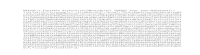

# MPARC

MPAR archive reimplemented in C instead of C++, more advanced than before.

## Enough of the boring stuff

### Why should I use this library and archive format

An archive format, but not just that. It's in plain text! Not any plain text, ASCII plain text! Even binary files are in plain text because we use Base64 encoding on them!

You can manipulate and extract these archives with a text editor, a crc32 encoder and a base64 encoder/decoder!

Versatile! You can make it into a key value database store somehow. Can store literal bytes of structs (uh oh endian problems)!

### Why shouldn't I use this library and archive format

The code I wrote may not be up to quality control.

This code pulls in libc and uses dynamic allocation. 

Calloc hater? Not for you, this library is proliferated with calloc calls.

Oh also the archives are bigger than zip or tar as they are binary based and this format is plain text based and plain text files are larger than binary files.

### Teach me how to build it

You only need libc for standard functions, but (the boehm garbage collector/dmalloc) can be used to debug memory issues.

> Also this can be built with the old makefile (Makefile.dumb) (trust me, I am the old method), autotools (Less broken, but still yes you need to make it yourself) or CMake (it works, please do it in the build/ directory).

### How can I implement this format in my own method?

Go to [the source code](./mparc.c) and find the MPARC_construct_str function body, there is the instruction there for you on how to construct the archive by hand, you can also use the hand construction instructions to make your own library.

You also know how to parse the file just by looking at the specification on file construction.

Read those instructions, think about parsing it and putting it together and there you have your own library!
